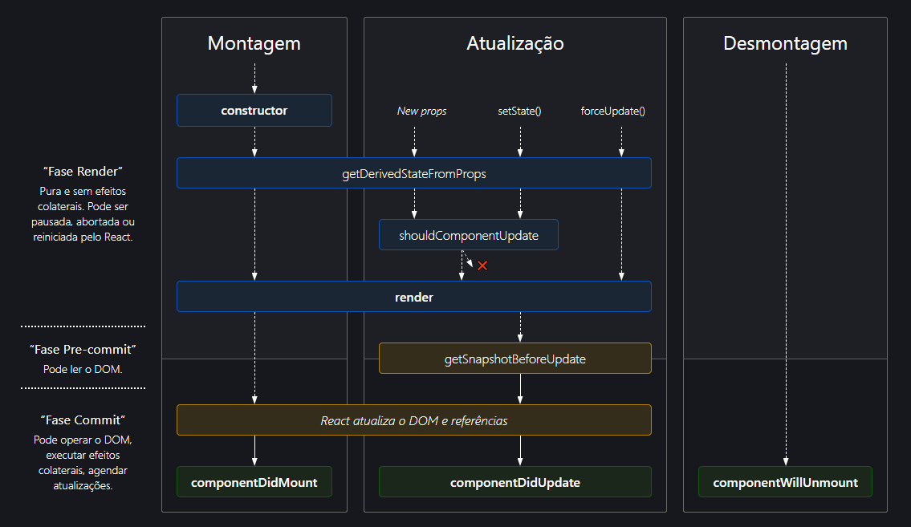

## O que é o lifecycle no React?

De maneira simples e direta, o lifecycle se refere aos 3 estágios que um componente React passa durante a sua existência.
Todo componente no React passa por três estágios que são:

1. **Montagem**
2. **Atualização**
3. **Desmontagem**

> É importante que você, como desenvolvedor React, conheça essas 3 fases e quais os métodos associados a cada uma delas. Esses métodos podem ser sobreescritos em **componentes de classe** para realizarmos efeitos colaterais e gerênciar o estado do componente.

Vamos dar uma olhada nesses métodos em cada uma das fases:

### Montagem (Mouting)

Essa é a fase inicial de qualquer componente. Ela corresponde ao momento em que o componente vai ser inserido no DOM. Ou seja, quando ele passa a existir na tela do seu navegador.
Nessa fase existem 4 métodos que são executas na ordem a seguir:

1. contructor()
2. getDerivedStateFromProps()
3. render()
4. componentDidMount()

Desses métodos, somente o terceiro (render) é obrigatório na criação de um componente de classe. Os outros ficam a cargo do desenvolvedor em implementá-los ou não no seu componente.

O primeiro, `constructor`, é utilizado em componentes React para definirmos o valor initial de estado.

Já o método `getDerivedStateFromProps` é utilizado com um único propósito: Ele permite que um componente atualize seu estado através de uma mundança de props. Veja dois exemplos do uso dela [aqui](https://reactjs.org/blog/2018/03/27/update-on-async-rendering.html#updating-state-based-on-props) e [aqui](https://reactjs.org/blog/2018/03/27/update-on-async-rendering.html#fetching-external-data-when-props-change). No exemplo a seguir eu defino o estado do contador com o valor passado na prop _valorInicial_.

O terceiro e único obrigatório é o `render`. Quando chamado, ele deve examinar this.props e this.state e retornar um dos seguintes tipos: Um elemento React, um Portal, uma string, um número, um booleano ou o valor null. O método `render` **deve permanecer puro**, ou seja, não crie efeitos colaterais (como chamadas a API's) nele.

```jsx:
import React from "react";

class MeuComponente extends React.Component {

    constructor(props){
        super(props);
        this.state = { contador: 0 }
    }

    static getDerivedStateFromProps(props, state) {
        return { contador: props.valorInicial }
    }

    render() {
        return <h1>Olá Lifecycle</h1>
    }

    componentDidMount() {
        console.log('Aqui meu componente já renderizou 😅')
    }
}
```

Hoje não é mais necessário você chamar o constructor para iniciar um estado, o que descarta a sua necessidade. Já o método getDerivedStateFromProps adiciona uma complexidade a mais no nosso componente e no geral você não vai precisar usá-la. [Esse post no blog do React indica o porque de não usar estado derivados](https://reactjs.org/blog/2018/06/07/you-probably-dont-need-derived-state.html)

### Atualização (Updating)

Quando o componente sobre alguma alteração de props (ou seja, seu componente pai passa novas props) ou quando o state interno sobre uma alteração (por this.setState({}) por exemplo) o componente entra na fase de atualização.

Assim como na fase de montagem, uma sequência definida de métodos será chamada. São eles:

1. getDerivedStateFromProps()
2. shouldComponentUpdate()
3. render()
4. getSnapshotBeforeUpdate()
5. componentDidUpdate()

O primeiro método, `getDerivedStateFromProps` nós já conhecemos e abordamos na fase de montagem. O seu comportamento é igual aqui na fase de atualização.

O segundo método, `shouldComponentUpdate` vai determinar se os métodos na sequência serão executados ou não. Ou seja, ele vai determinar se o componente deve ser renderizado novamente ou não. Esse método existe somente como uma maneira de evitarmos uma atualização desnecessária, e assim otimizarmos a performance das nossas aplicações.

Caso o método `this.forceUpdate()` tenha sido chamado a atualização não chamará shouldComponentUpdate, e o componente vai ser atualizado de maneira forçada como o nome indica.

`getSnapshotBeforeUpdate` é então chamado logo antes da saída renderizada mais recentemente ser confirmada. Ele permite que seu componente capture algumas informações do DOM (por exemplo, a posição da rolagem) antes de ser potencialmente alterado. Qualquer valor retornado por este ciclo de vida será passado como um terceiro parâmetro, chamado de snapshot, para o método componentDidUpdate.

Com o DOM atualizado, o método `componentDidUpdate` é por fim chamado.


```jsx:
import React from "react";

class MeuComponente extends React.Component {

    static getDerivedStateFromProps(props, state) {
        return null
    }

    shouldComponentUpdate() {
        return true
    }

    render() {
        return <h1>Olá Lifecycle!</h1>
    }

    getSnapshotBeforeUpdate(prevProps, prevState){
        return 'esse é o snapshot'
    }

    componentDidUpdate(prevProps, prevState, snapshot) {
        console.log('Aqui meu componente já atualizou ♥')
    }
}
```

### Desmontagem (Mouting)

Quando o componente vai ser removido do DOM, por mudança de state ou props, nós estramos na desmontagem.
Aqui temos somente um método de ciclo de vida que é:

1. componentWillMount()

Esse método é executado logo antes do componente ser removido. Ele é usado para remover inscrições e listeners. Um exemplo é com o uso do setInterval, que, mesmo que o componente seja removido, ele vai continuar a ser executado independente da existencia do componente que o invocou.

```jsx:
import React from "react";

class MeuComponente extends React.Component {

    componentWillUnmount() {
        console.log('Aqui meu componente vai desaparecer 😢')
    }
}
```

### Métodos legado

Por gerar confusão e alguns bugs difícieis de resolver, alguns métodos do ciclo de vida do React estão sendo depreciados. Na versão 17 eles ainda poderam ser usados com o prefixo UNSAFE_ na frente dos seus nomes. Para entender mais o motivo da depreciação, [veja esse post no blog do React.](https://reactjs.org/blog/2018/03/27/update-on-async-rendering.html)

1. UNSAFE_componentWillMount()
2. UNSAFE_componentWillReceiveProps()
3. UNSAFE_componentWillUpdate()


### Resumo

O diagrama a seguir resumo bem os três ciclos de vida e os métodos que discutirmos na sua sequência de execução:
